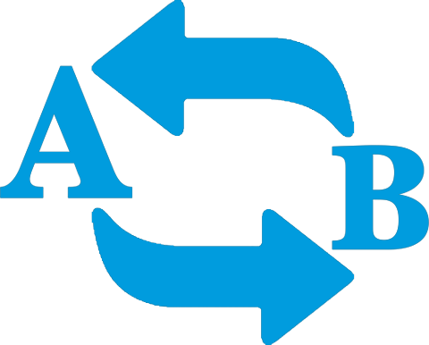

<h1 align="center">
    
</h1>

## 💻 Repository Summary

An indispensable web application to edit words and phrases, using uppercase, lowercase letters and title format, also having the options of consonants in uppercase and uppercase vowels, in addition to being able to copy and delete the typed and / or converted content.

## 🛠 Technologies

Project was built using **HTML** and **CSS** but what is it?

- **HTML** - Or HyperText Markup Language, which means: "Hypertext Markup Language" is a markup language used in the construction of the "skeleton" of web pages.

- **CSS** - Or Cascading Style Sheets is a mechanism for adding style to a web document.

## 🔨 Local Installation

You will need [GIT](https://git-scm.com/) in the most up-to-date version installed on your computer to continue.

```bash
$ cd word-converter
$ code .
```

And now to run our game locally just open the `index.html` file and open it with the **[Live Server](https://marketplace.visualstudio.com/items?itemName=ritwickdey.LiveServer)** extension

## 📖 License

This project is under license from MIT. See the [LICENSE](LICENSE.md) file for more details.
